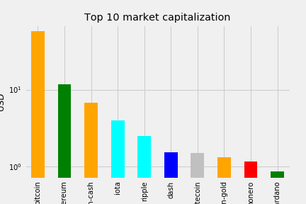

# Data Science and Python Portfolio

[Open catalogue in nbviewer](http://nbviewer.jupyter.org/github/kajzer/bootcamp_data_science/tree/master/)

**Table of Contents**

- [Data Science and Python Portfolio](#data-science-and-python-portfolio)
  * [Bootcamp Data Science](#bootcamp-data-science)
    + [Session 4 Projects](#session-4-projects)
    + [Session 3 Projects](#session-3-projects)
    + [Session 2 Projects](#session-2-projects)
    + [Session 1 Projects](#session-1-projects)
  * [Aditional DataScience scripts](#aditional-datascience-scripts)
    + [Projects](#projects)
      - [DataFrame/Pandas manipulation and visualization](#dataframe-pandas-manipulation-and-visualization)
    + [Pandas](#pandas)
    + [NumPy](#numpy)
    + [Math](#math)
    + [Ploting](#ploting)
  * [Additional scripts in python](#additional-scripts-in-python)
    + [Counting emails](#counting-emails)
    + [Many to many relational db](#many-to-many-relational-db)
    + [Hangman Game](#hangman-game)
    + [Excel file handling](#excel-file-handling)
    + [Itunes tracks parser](#itunes-tracks-parser)
    + [PDFs handling](#pdfs-handling)
    + [Linked list](#linked-list)
    + [Iterable](#iterable)
    + [Fibonacci sequence generator](#fibonacci-sequence-generator)
    + [Quiz generator](#quiz-generator)
    + [Twilio API](#twilio-api)
    + [Google maps from console](#google-maps-from-console)
    + [Get weather from command line](#get-weather-from-command-line)
    + [Check profanity in txt file](#check-profanity-in-txt-file)
    + [Console logging](#console-logging)
    + [Copy passwords to clipboard](#copy-passwords-to-clipboard)
    + [Pomodoro and file rernaming](#pomodoro-and-file-rernaming)

[Link](https://github.com/kajzer/rails_ruby) to Ruby and Ruby on Rails protfolio

## Bootcamp Data Science

### Session 4 Projects

Link: **[Manipulating pandas dataframes to match SQL queries](./Week_04/db_pandas_excercise.ipynb)**  
Excercises in pandas dataframes manipulation to return same result as SQL queries made to SQLite bd.

Link: **[Manipullating movies dataset and mergin with users and ratings datasets](./Week_04/movies_dataset.ipynb)**  
Manipulating, mergin and cleanng of 3 datasets: Movies, Users, Ratings.

Link: **[Lecture notes from pandas](./Week_04/lecture_pandas.ipynb)**  
Pandas lecture notes.

Link: **[Matplotlib excercises](./Week_04/matplot_excercises.ipynb)**  
Matplotlib excercises.

Link: **[Matplotlib watch excercise](./Week_04/watch.ipynb)**  
Creating watch in matplotlib.

Link: **[Matplotlib module lecture notes](./Week_04/matplot_lecture.ipynb)**  
Matplotlib lecture notes.


### Session 3 Projects

Link: **[Numpy arrays excercises](./Week_03/exercises_numpy.ipynb)**  
Few excercises with numpy and some linear regresion.

### Session 2 Projects

Link: **[Flask API Endpoint](./Week_02/flask_api.py)**  
Implement simple API with flask and sqlalchemy. To run app:

```python
FLASK_APP=flask_api.py flask run
```

Link: **[Class for parsing error logs](./Week_02/Parse_syslog.ipynb)**  
Jupyter notebook with class to parse and ad error logs to DB using sqlalchemy.

Link: **[Methods for db manipulation with ssqlalchemy](./Week_02/PostgreSQLpython.ipynb)**  
Few methods for DB manipulation using PostgreSQL

### Session 1 Projects

Link: **[Refactor - OOP and linear regression](./Week_01/Refactor_OOP_and_linear_regression.ipynb)**  
Implemented class with inheritance, simple abstract factory design pattern, calss method, static method, class variable, dunder methods, and property. Class has a simple linear reggresion model. Earlier version can be found under [>>>](./Week_01/class_and_linear_regression.ipynb)

Link: **[Co-variance, correlation, std deviation](./Week_01/Covariance_Pearsons_correlation_Standard_deviation.ipynb)**  
Implemented functions returning co-variance, Pearson's correlation and standard deviation. Rendered equations using Latex

Link: **[Create plot with matplotlib](./Week_01/create_list_of_users_and_plot.ipynb)**  
Plot garaph from two lists

Link: **[Create histogram](./Week_01/plot_numpy_arrays.ipynb)**  
Create histogram with matplotlib

Link: **[Create histogram](./Week_01/Matplot.ipynb)**  
Create plot with matplotlib

Link: **[system shell acces with ipython](./Week_01/System_shell_access_jupyter.ipynb)**  
Access terminal functions and variables from within jupyter notebooks

Link: **[list comprehensions](./Week_01/zadanie6.py)**  
Simple list comprehension

## Aditional DataScience scripts

### Projects

#### DataFrame/Pandas manipulation and visualization

[Exploring Bitcoin market cap](./Additional/Projects/exploring_bitcoin_cryptocurrency_market/bitcoin.ipynb) - DataCamp



[Kardashian google search trends over time](./Additional/Projects/kardashians_google_search_results/kardashians.ipynb) - DataCamp


[Exploring 67 years of LEGO](./Additional/Projects/exploring_67_years_LEGO/lego.ipynb) - DataCamp

[Summer Olympics Games dataset manipulation](./Additional/Projects/summer_olympic_games/summer_olympics.ipynb) - DataCamp


[Austin weather dataset manipulation](./Additional/Pandas/austin_weather_dataset.ipynb) - DataCamp


### Pandas

[Grouping data](./Additional/Pandas/grouping_data.ipynb)

[Pandas time series](./Additional/Pandas/pandas_time_series.ipynb)


[Exploratory data analysis](./Additional/Pandas/exp_data_analysis.ipynb)


[Cleaning and ploting Gapminder data](./Additional/Pandas/cleaning_gapminder.ipynb)


[Cleaning data for analysis](./Additional/Pandas/cleaning_data_analysis.ipynb)

[Cleaning data](./Additional/Pandas/cleaning_data.ipynb)

[Combining data in Pandas](./Additional/Pandas/combining_data.ipynb)

[Preparing data](./Additional/Pandas/preparing_data.ipynb)

[Rearrange and reshape data in pandas](./Additional/Pandas/rearrange_reshape_data.ipynb)

[Advanced indexing](./Additional/Pandas/adv_indexing.ipynb)

[Extracting and transforming data](./Additional/Pandas/extracting_transforming_data.ipynb)

[Pandas foundations](./Additional/Pandas/pandas_intro.ipynb)


### NumPy

[Basic info about NumPy](./Additional/Numpy/numpy_arrays.ipynb)

[Info about NumPy](./Additional/Numpy/dc_numpy.ipynb)

[Subseting NumPy arrays](./Additional/Numpy/numpy_subseting.ipynb)

[Operations on NumPy arrays](./Additional/Numpy/numpy_operations.ipynb)

[spliting, deep copies, casting, ix_](./Additional/Numpy/spliting_copeis_casting.ipynb)

### Math

[Conditional Probability](./Additional/Math/conditional_probability.ipynb)

[Covariance and Correlation](./Additional/Math/cov_corr.ipynb)

[Mean, median, mode](./Additional/Math/mean_median_mode.ipynb)  

[Variation, Standard Deviation](./Additional/Math/standard_deviation_variance.ipynb)

[Common data distributions](./Additional/Math/common_data_distributions.ipynb)

[Percentiles and moments](./Additional/Math/percentiles_and_moments.ipynb)

### Ploting

[Ploting from remote source](./Additional/Ploting/Matplotlib/remote_url_plot_df.ipynb)

[Plot types](./Additional/Ploting/Matplotlib/plot_types_matplotlib.ipynb)


## Additional scripts in python

More scripts in python can be found **[here](https://github.com/kajzer/python_scripts_training)**  
*Made on basis of py4e.com, Udacity, python notes for professionals, automate the borring stuff with python*

### Counting emails

Link: **[counting_emails_db](./counting_emails_db)**  
**Used:** SQL, txt file parsing  
run db_connect.py - connect to db. Parse file for emails (press enter if no file, there is a fall back). The script will add domain names of emails to db.

### Many to many relational db

Link: **[many_to_many](./many_to_many)**  
**Used:** SQL, JSON  
script will parse json format and setup many to many db with courses and attendees with parsed data  

### Hangman Game

Link: **[Hangman Game](./hangman)**  
**Used:** random, requests, urllib, json, string  
Game of hangman with a random word taken from an API.

### Excel file handling

Link: **[excel automation](./excel_automation)**  
**Used:** openpyxl, pprint  
Script to automate *xlsx files. Requires OpenPyXL (pip3 install openpyxl)  
xlsx_repo.py - opening, getting sheets, traversing, etc.    
read_data_from_xlsx.py - read from the census spreadsheet file and calculate statistics for each county  

### Itunes tracks parser

Link: **[tracks](./tracks)**  
**Used:** SQL, XML  
application will read an iTunes export file in XML and produce a properly normalized database

### PDFs handling

Link: **[pdf_combine](./pdf_combine)**  
**Used:** PyPDF2, os, glob  
Combine pages without cover page from many *.pdf files into a single *.pdf  
Requires PyPDF2: sudo pip3 install PyPDF2

### Linked list

Link: **[linked_list](./linked_list)**  
linked list implementation in python

### Iterable

Link: **[iterable](./iterable)**  
build a Basic Python Iterator

### Fibonacci sequence generator

Link: **[Fibonacci generator](./fibonacci_generator)**   
generate first n numbers from Fibonacci series. Can be run as executable ./fibonacci_generator.py [#_of_numbers_in_sequance]. Uses sys.argv with try except block for validation and checking input errors. 

### Quiz generator

Link: **[quiz generator](./quiz_generator)**  
**Used:** file handling  
Generating different quizzes with multiple choice questions.

### Twilio API

Link: **[send_sms](./send_sms)**  
**Used:** Twilio API  
Sending sms with twilio API - for this to work script needs valid credentails

### Google maps from console

Link: **[map it](./mapit)**  
Opens google maps to specified location from command line arguments  
Usage example: ./mapit.py 870 Valencia St, San Francisco, CA94110
Need to install: pip install pyperclip

### Get weather from command line

Link: **[get weather](./get_weather)**  
**Used:** json, requests, sys, urllib  
Gets weather from openweathermap (only sample) for current location provided in command line arguments (needs API key - in this form always gets London)  
Usage: python3 get_weather.py London

### Check profanity in txt file

Link: **[profanity_checker](./profanity_checker)**  
**Used:** url encode  
Simple script to read from a txt file and hit url with contents to check if text contains curse words.

### Console logging

Link: **[logging_to_consoe](./logging_to_console)**   
Logging every step of factorial to console

### Copy passwords to clipboard

Link: **[passwords_copy](./passwords_copy)**  
Insecure password holder. Will copy to clipboard password for given account. Usage: ./pw.py [some_account]. To run as executable permissions are required: sudo chmod +x pw.py  

### Pomodoro and file rernaming

Link: **[pomodoro_rename_files](./pomodoro_rename_files)**  
  break_time.py - simple program to wait and open up a browser with provided link  
  rename_photos.py - script to rename files - remove numbers from the beggining of a file name